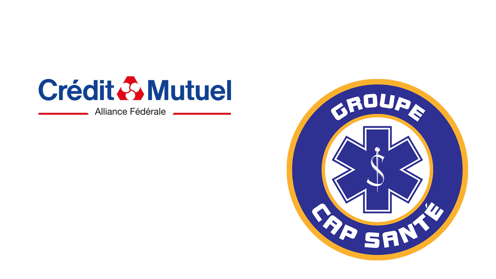

<h1 align="center">Bonjour, je suis Lilian Doublet, bienvenue sur mon GitHub 👋</h1>

  
  

  
  
  
  
  
  
  
  
  
  

---

### À propos de moi 🚀

👨‍💻 Passionné par la Data Analytics, la Data Science et l'IA

🧑‍🎓 En apprentissage continu, toujours curieux et autonome

✍️ Obsédé par une documentation claire et bien structurée

---

## Mes expériences 👀
- [Data Analyst chez Crédit Mutuel Alliance Fédérale (Stage)](https://www.creditmutuel.fr/fr/alliancefederale.html)
- [Data Analyst chez Capsanté Ambulances (Freelance)](https://www.capsanteambulances.fr/)

  

  
---
### 🛠️ Stack technique

**Langages** : Python, SQL, DAX

**Analyse de données** : pandas, NumPy, analyse exploratoire (EDA), analyse statistique, conception de KPI, A/B testing, data storytelling, Excel

**Data viz / BI** : Power BI (modélisation en schéma en étoile, mesures DAX), Streamlit, Matplotlib, Plotly, Seaborn

**ML / NLP** : scikit-learn, Hugging Face Transformers (CamemBERT), prévision de séries temporelles (ARIMA, SARIMA, LSTM)

**GenAI / LLM** : Retrieval-Augmented Generation (RAG), LangGraph, API Anthropic Claude, API Gemini, ChromaDB, Ollama

**Bases de données** : PostgreSQL, VerticaPy

**Cloud / Infra** : AWS (Lambda, S3, EventBridge), Docker, FastAPI

**MLOps / outillage** : MLflow, Git, GitHub Actions (CI), pytest, pre-commit, ruff, uv

---

### 📌 Projets phares

- **[HR-Dashboard](https://github.com/liliandoublet/HR-Dashboard)** : tableau de bord RH interactif (Python, Dash, Plotly) réalisé pendant mon stage de Data Analyst au Crédit Mutuel Alliance Fédérale. Transforme plus de 50 000 enregistrements RH en KPI et en reporting en libre-service pour l'équipe Transformation Digitale RH.

- **[walmart-sales-forecasting](https://github.com/liliandoublet/walmart-sales-forecasting)** : tableau de bord de prévision des ventes sous Power BI. Schéma en étoile, mesures DAX et prévision SARIMA atteignant 2,22 % de MAPE, conçu pour appuyer la prise de décision métier.

- **[sql-portfolio](https://github.com/liliandoublet/sql-portfolio)** : projet SQL illustrant les opérations DDL et DML fondamentales : création et modification de tables, insert / update / delete, requêtes SELECT, jointures, agrégations (GROUP BY, HAVING) et contrôles de qualité des données.

- **[sherlock](https://github.com/liliandoublet/sherlock)** : pipeline NLP français prêt pour la production. Construit avec uv, Pydantic, Typer CLI, loguru, MLflow, CamemBERT, pytest et GitHub Actions CI.

- **[camembert-discours-politique](https://github.com/liliandoublet/GraduateProject)** : CamemBERT fine-tuné pour la classification multi-classes du discours politique français. Plus de 15 000 textes annotés, suivi d'expériences avec MLflow, mémoire noté 87/100.

- **[askmydocs](https://github.com/liliandoublet/askmydocs)** : assistant RAG pour interroger vos propres documents. Construit avec ChromaDB, l'API Gemini et une stack Streamlit / Docker, avec un harnais d'évaluation mesurant le hit rate et le keyword recall.

- **[techradar](https://github.com/liliandoublet/techradar)** : agent AWS serverless (Lambda, S3, EventBridge) qui scrape et résume l'actualité tech avec Google Gemini et LangGraph, livré par email via SendGrid.

- **[newflights](https://github.com/liliandoublet/newflights)** : application d'optimisation de billets d'avion. Frontend React / TypeScript / Vite, backend FastAPI.

---

### 📫 Me contacter

  
  
  

